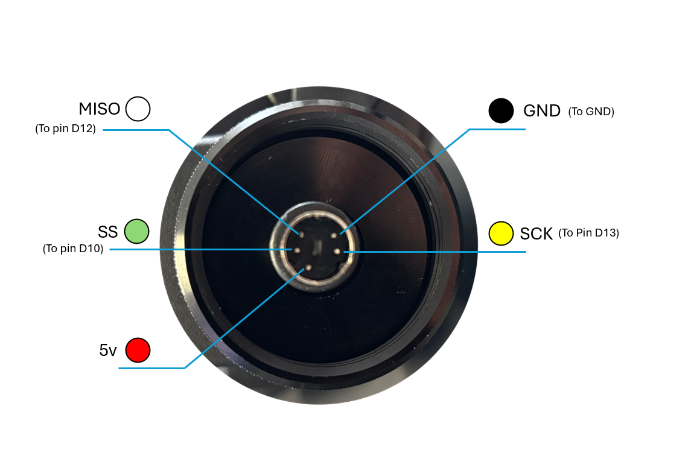
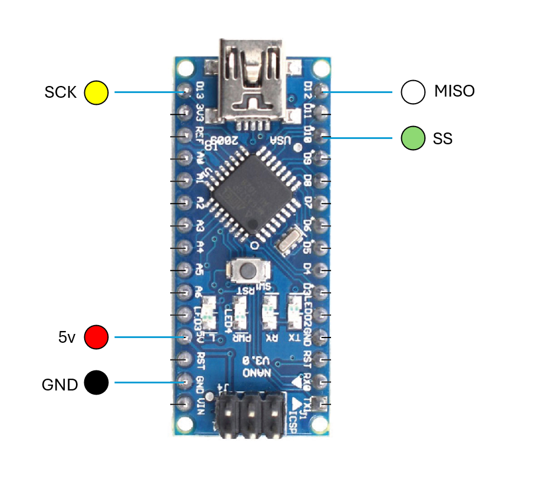

# Virpil base to arduino wiring

Virpil bases use "MINI DIN 5P" connectors, wire your connector to your arduino according to this diagram





# Import the library into you arduino IDE

go to sketch / include library / Add .ZipLibrary

then select the zip file you downloaded here from the release 

# Arduino code

include the virpilgrip library 

```
#include
```

declare a new VirpilGrip object :

```
VirpilGrip _grip;
```

Initialise the grip communication

```
_grip.Initialize();
```

Update the grip input in the loop()

```
_grip.Set_Button(1, btn!status);
```

Here is the complere example : 

```
#include<VirpilGrip.h>

VirpilGrip _grip;
bool _btn_status;

void setup()

{
  Serial.begin(9600);
  _grip.Initialize();
}

void loop()

{
  _btn_status = !_btn_status;
  _grip.Set_Button(1, _btn_status);
  Serial.println(_btn_status);
  delay(1000);
}
```
